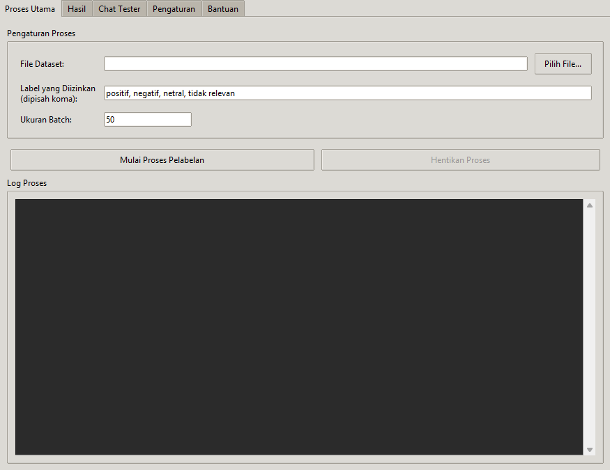

# Aplikasi Pelabelan Data Otomatis dengan Gemini

Ini adalah aplikasi desktop yang dirancang untuk mempercepat dan mengotomatiskan proses pelabelan data teks (seperti sentimen tweet atau ulasan produk) menggunakan Google Gemini API. Model Gemini dikenal memiliki kemampuan _reasoning_ yang kuat, sehingga cocok digunakan untuk tugas-tugas yang memerlukan pemahaman konteks yang mendalam. Dalam aplikasi ini, kemampuan tersebut dimanfaatkan untuk memahami nuansa dalam teks, menghasilkan label yang akurat, dan memberikan justifikasi untuk setiap keputusannya.

Aplikasi ini dibangun dalam bentuk **graphical user interface** (GUI) dengan fitur-fitur seperti proses yang dapat dilanjutkan (resumeable), validasi output AI, dan konfigurasi yang sepenuhnya dinamis.



---

## ✨ Fitur Utama

- **Setup Sekali Klik**: Jalankan satu file (`start.bat` atau `start.sh`) untuk menyiapkan _virtual environment_ dan menginstal semua dependensi secara otomatis.
- **Graphical User Interface (GUI)**: Operasikan semua fitur melalui jendela aplikasi dengan sistem Tab yang terorganisir.
- **Konfigurasi Dinamis**: Atur model AI, direktori, dan API key langsung dari **Tab Pengaturan**, serta tentukan nama kolom teks target dari **Tab Proses Utama**.
- **Editor Prompt Terintegrasi**: Modifikasi dan simpan instruksi untuk AI secara _real-time_ dari dalam **Tab Editor Prompt**.
- **Validasi Label Cerdas**: Tentukan sendiri label yang Anda inginkan (misal: "positif, negatif"), dan aplikasi akan otomatis mencoba ulang jika AI memberikan output yang tidak sesuai.
- **Proses Latar Belakang & Kontrol Penuh**: Proses pelabelan berjalan di _thread_ terpisah agar aplikasi tetap responsif, lengkap dengan tombol "Hentikan Proses".
- **Dapat Dilanjutkan (_Resumable_)**: Jika proses berhenti, aplikasi akan melanjutkan dari _checkpoint_ terakhir tanpa kehilangan progres.
- **Monitoring & Bantuan Terintegrasi**: Pantau log secara _real-time_, lihat ringkasan hasil pekerjaan, dan baca panduan penggunaan langsung di dalam aplikasi.

---

## 🚀 Workflow Aplikasi

Aplikasi ini dirancang untuk digunakan sepenuhnya melalui GUI.

### Langkah 1: Setup Awal (Hanya Sekali)

Pastikan Anda sudah **menginstal Python 3** di komputer Anda.

1.  **Jalankan Skrip Peluncur**:

    - **Windows**: Klik dua kali file **`start.bat`**.
    - **macOS / Linux**: Buka Terminal, jalankan `chmod +x start.sh` (hanya sekali), lalu jalankan `./start.sh`.

    Skrip ini akan secara otomatis membuat _environment_, menginstal semua yang dibutuhkan, lalu membuka jendela aplikasi.

### Langkah 2: Konfigurasi & Proses di Dalam Aplikasi

Setelah aplikasi terbuka, ikuti alur kerja ini:

1.  **Tab `Pengaturan`**: Masukkan **API Key Google** Anda dan sesuaikan konfigurasi lainnya. Klik **"Simpan"**.
2.  **Tab `Editor Prompt`**: Sesuaikan instruksi untuk AI. Pastikan format output yang diminta adalah `Label - Justifikasi`. Klik **"Simpan"**.
3.  **Tab `Chat Tester`**: (Opsional tapi direkomendasikan) Uji coba _prompt_ Anda dengan beberapa contoh teks untuk memastikan AI memberikan output sesuai format.
4.  **Tab `Proses Utama`**:
    - Pilih **File Dataset** Anda.
    - Masukkan **Nama Kolom Teks** yang benar.
    - Masukkan **Label yang Diizinkan** (dipisah koma), pastikan sinkron dengan _prompt_.
    - Atur **Ukuran Batch** (lihat tips di bawah).
5.  **Mulai Proses**: Klik **"Mulai Proses Pelabelan"**.

---

## 💡 Tips Penting & Best Practice

### 1. Uji Coba Prompt Terlebih Dahulu!

Sebelum menjalankan pelabelan pada ribuan data, gunakan **Tab `Chat Tester`**.

- **Verifikasi Format**: Pastikan model AI benar-benar mengeluarkan output `Label - Justifikasi`. Jika tidak, perbaiki instruksi Anda di **Tab `Editor Prompt`**.
- **Hemat Kuota**: Melakukan verifikasi ini mencegah kegagalan format berulang di tengah proses pelabelan, yang akan membuang-buang kuota API Anda.
- **Konteks Stateless**: Ingat, API ini bersifat **stateless**. Model tidak mengingat permintaan sebelumnya. Oleh karena itu, seluruh instruksi (konteks) harus ada di dalam _prompt_ setiap kali permintaan dikirim.

### 2. Memilih Ukuran Batch yang Tepat

Ukuran batch adalah _trade-off_. Tidak ada satu angka yang sempurna, jadi pilihlah berdasarkan kebutuhan Anda:

- **Batch Kecil (misal: 20-100)**:
  - **Kelebihan**: Sangat aman dari **limit token**. Model seperti `gemini-1.5-pro` memiliki batas token (misal: 32.768). Jika total teks dalam satu batch melebihi batas ini, permintaan akan gagal. Batch kecil mencegah ini.
  - **Kekurangan**: Menghasilkan lebih banyak permintaan API. Jika Anda memiliki batasan request per minute/day (RPM/RPD), ini bisa lebih cepat tercapai.
- **Batch Besar (misal: 200-500)**:
  - **Kelebihan**: Lebih sedikit permintaan API, lebih efisien dalam penggunaan kuota RPD.
  - **Kekurangan**: Berisiko tinggi mengalami **limit token**, terutama jika teks Anda panjang-panjang.

**Rekomendasi**: Mulailah dengan batch kecil (misal: **50**), dan jika berjalan lancar tanpa error token, Anda bisa mencoba menaikkannya secara bertahap.

### 3. Kustomisasi Prompt untuk Akurasi

Kualitas pelabelan bergantung sepenuhnya pada prompt Anda di **Tab `Editor Prompt`**.

- **Jadilah Spesifik**: Berikan contoh yang relevan dengan konteks data Anda.
- **Sinkronkan Label**: Pastikan daftar label di _prompt_ sama dengan yang Anda masukkan di _field_ "Label yang Diizinkan" di GUI.

---

### Format Dataset

- Aplikasi mendukung file `.csv` atau `.xlsx`.
- Pastikan file Anda memiliki kolom teks yang namanya Anda masukkan di _field_ "Nama Kolom Teks" di GUI.

## 📂 Struktur Proyek

```.
├── src/
│   ├── core_logic/
│   │   ├── env_manager.py
│   │   ├── process.py
│   │   └── utils.py
│   └── gui/
│       └── app.py
├── dataset/
│   └── data_sample/
├── results/
├── logs/
├── main.py
├── start.bat
├── start.sh
├── .env
├── .env.example
├── prompt_template.txt
└── requirements.txt
```

---

## 🛠️ Manual Setup (Untuk Developer)

Jika Anda lebih suka menjalankan proyek secara manual atau ingin melakukan pengembangan, ikuti langkah-langkah berikut:

### 1. Prasyarat

- **Python 3.8+** terinstal.
- **Git** terinstal.

### 2. Langkah-langkah

1.  **Clone Repositori**:
    Buka terminal atau Git Bash dan jalankan perintah berikut:

    ```bash
    git clone https://github.com/muhffikkri/auto-labeling-data-text-aistudio.git
    cd auto-labeling-data-text-aistudio
    ```

2.  **Buat Virtual Environment**:
    Sangat disarankan untuk menggunakan _virtual environment_ agar dependensi proyek tidak tercampur dengan instalasi Python global Anda.

    ```bash
    python -m venv venv
    ```

3.  **Aktifkan Environment**:

    - **Windows**:
      ```bash
      venv\Scripts\activate
      ```
    - **macOS / Linux**:
      ```bash
      source venv/bin/activate
      ```

    Anda akan melihat `(venv)` di awal baris terminal Anda jika berhasil.

4.  **Install Dependensi**:
    Gunakan `pip` untuk menginstal semua _library_ yang dibutuhkan dari file `requirements.txt`.

    ```bash
    pip install -r requirements.txt
    ```

5.  **Konfigurasi `.env`**:
    Salin file contoh `.env.example` menjadi `.env` baru.

    ```bash
    # Windows
    copy .env.example .env
    # macOS / Linux
    cp .env.example .env
    ```

    Buka file `.env` yang baru dibuat dan isi dengan API Key serta konfigurasi lain yang Anda perlukan.

6.  **Jalankan Aplikasi**:
    Setelah semua persiapan selesai, jalankan aplikasi menggunakan file `main.py`.
    ```bash
    python main.py
    ```

---
